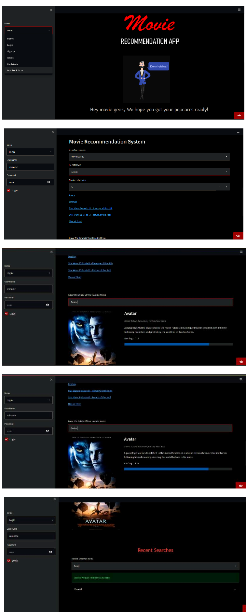
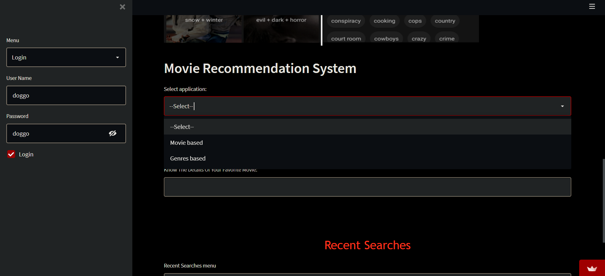

# Movie-Recommendation-Engine-Engage-22-
This is a Movie Recommendation Web app built using Streamlit Library as a part of Microsoft Engage mentorship Programme


# Movie Recommendation System

RUNNING AT: https://share.streamlit.io/juhii16/movie-recommendation-engine-engage-22-/app.py

### Table of Contents
**[Description](#description)**<br>
**[Installation](#installation)**<br>
**[Usage Instructions](#usage-instructions)**<br>

## Description


This is a Movie Recommendation system which uses K Nearest Neighbour Algorithm to do content based filtering to recommend movies to users based on their input. To fetch the movie plot and IMDb rating it uses OMDb Api.The link for the same is 
https://www.omdbapi.com/

The movie database file which I have used in my project can be found in this git Repo for anyone to use.

In case if you want recent databse so you can visit Kaggle (The link for which is Down below)
[-> Link to download dataset from Kaggle <-](https://www.kaggle.com/rounakbanik/the-movies-dataset?select=ratings.csv)

**THis project aims to be more unique and personalized using other methods and a web user interface using streamlit (https://streamlit.io/)**
Here is how the interface looks like :



### About the dataset

>The dataset consists of movies released on or before July 2017. Data points include cast, crew, plot keywords, budget, revenue, posters, release dates, languages, production companies, countries, TMDB vote counts and vote averages.
>This dataset also has files containing 26 million ratings from 270,000 users for all 5044 movies.
>There are around 26-27 Genre to fliter out your movie.


---

## Installation and set-up 

1- Clone the git repo or download the zip folder

2- Create a python virtual environment 
  To create a virtual environment you can visit (here is the link for refrence) https://docs.python.org/3/library/venv.html

3- Then install these libraries 

   Streamlit -> Display the app (working on deployment)  
   SQLite3 -> For easier and faster access to the database  
  
````python
pip install -r requirements.txt 
pip3 install -r requirements.txt
````
4- In case if there are any errors in executing above commands try installing packages mentioned in app.py file manually.

5- To run the project, navigate inside the project directory and type the following command in a python terminal or powershell. 
````python
streamlit run app.py
````
   and here you go :)


### Usage Instructions
### Types of recommendations
Here is type of recommendations it offers basically on movie based and genre based



