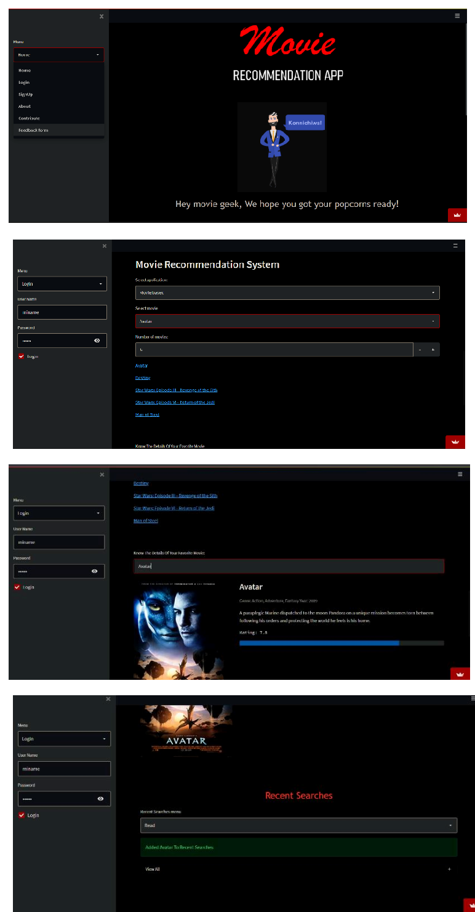

# Movie-Recommendation-Engine-Engage-22-
This is a Movie Recommendation Web app built using Streamlit Library as a part of Microsoft Engage mentorship Programme


# Movie Recommendation System

RUNNING AT: https://share.streamlit.io/juhii16/movie-recommendation-engine-engage-22-/app.py

### Table of Contents
**[Description](#description)**<br>
**[Installation](#installation)**<br>
**[Usage Instructions](#usage-instructions)**<br>

## Description


Usually, when I go on Youtube I like to find videos related to Data Science or Deep Learning that I have not seen before.
However, sporadically I like to find songs, humoristic videos or even watch some matches of professional League of Legends.
The problem with this is that Youtube would start recommending me music or videogames clips in which I am not really interested.

Then, one night in bed I had a great idea "What if I could create a recommendation system, with different clusters and only see recommendations of the cluster I am interested in". 

Next day, I checked on Youtube and that option was already implemented, but since I don't use the platform that much I had not been aware of it.

Anyway, I wanted to test my idea, so I decided to build that system myself. As a proof of concept, instead of using the Youtube database, I will implement it using the MovieLens Dataset, that can be downloaded from Kaggle.

I have added database file which I have used in my git Repo in case if you want recent databse so you can visit Kaggle (The link for which is Down below)
[-> Link to download dataset from Kaggle <-](https://www.kaggle.com/rounakbanik/the-movies-dataset?select=ratings.csv)

**THis project aims to be more unique and personalized using other methods and a web user interface using streamlit (https://streamlit.io/)**
Here is how the interface looks like :



### About the dataset

>The dataset consists of movies released on or before July 2017. Data points include cast, crew, plot keywords, budget, revenue, posters, release dates, languages, production companies, countries, TMDB vote counts and vote averages.
>This dataset also has files containing 26 million ratings from 270,000 users for all 5044 movies.
>There are around 26-27 Genre to fliter out your movie.


---

## Installation

Firstlt your code editor will ask to create a python virtual environment so you need to create a virtual env in the folder only. And in case it doesnt asks
you yourself create a virtual env 
To create a virtual environment (here is the link for refrence) https://docs.python.org/3/library/venv.html

Then install these libraries 

Streamlit -> Display the app (working on deployment)  
SQLite3 -> For easier and faster access to the database  
  
````python
pip install -r requirements.txt 
pip3 install -r requirements.txt
````
In case if there is any error try installing packages mentioned in app.py file it will work
To run your project type 
````python
streamlit run app.py
````
and here you go :)

## Usage Instructions
### Types of recommendations
Here is type of recommendations it offers basically on movie based and genre based


